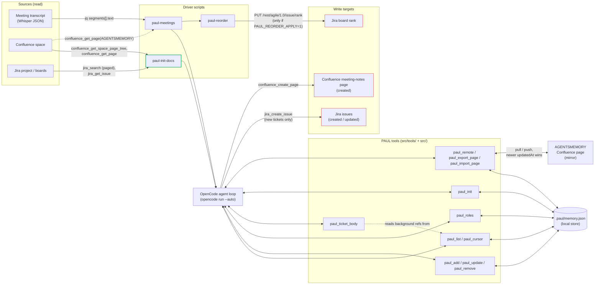
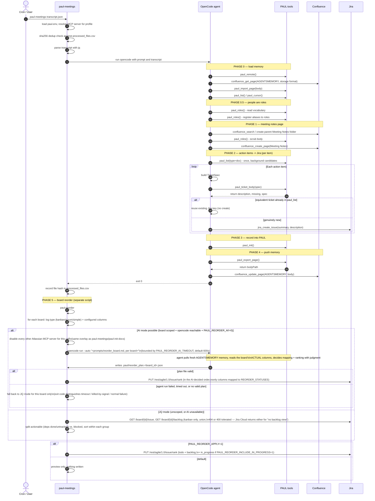
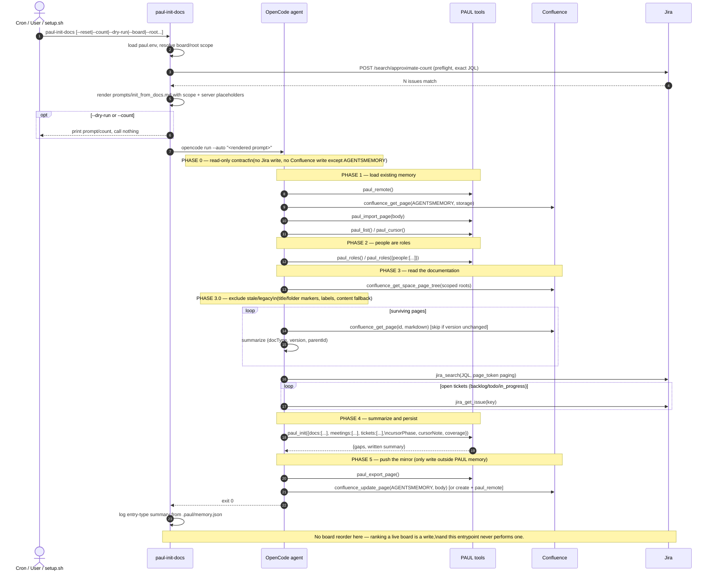

# Architecture

> **PAUL** = **P**ersistent (memory), **A**tlassian, **U**nderstanding, (**meeting**) **L**ogger.

## Problem / solution fit

**Problem.** An agent given project-management work — ordering tickets on a Kanban board,
tracking meeting decisions, turning a transcript into Jira tasks — has no memory between runs
unless something gives it one. Left to prose notes or ad-hoc tool calls, that state drifts and
contradicts itself across sessions, and nothing is shared between runs or teammates. Concretely,
per `paul-meetings`'s own header comment:

> PAUL is the memory layer: without it, each run was blind and re-created the same Jira tickets
> every time.

Three sharper sub-problems fall out of that:

1. **No record of what already exists** → the same recurring action item becomes a new Jira
   ticket every meeting instead of an update to the existing one.
2. **Real names leak into shared artifacts.** A meeting transcript is mostly names and unfiltered
   speech; write it through to a Confluence page or Jira ticket unfiltered and a name is now in
   documentation the whole space can read.
3. **Ticket quality drifts.** A model asked to "write a Jira description" free-form produces a
   different shape every run, and usually captures *what* to do, not *how* — because meetings
   agree on the former and skip the latter.

**Solution approach.** A structured, per-project memory store
(`<project-root>/.paul/memory.json`) — git-trackable, atomic JSON, no database — that the agent
reads and writes through defined verbs (`paul_list`, `paul_add`, `paul_update`, `paul_cursor`, …)
instead of free-form prose. Concretely:

- **Two entrypoints turn existing or new project knowledge into that memory.**
  `paul-init-docs` bootstraps it, read-only, from a Confluence space and Jira project
  that already exist. `paul-meetings` turns a new meeting transcript into Confluence notes
  plus deduped Jira tickets. Both write through the same store, so state accumulates run over run
  instead of resetting.
- **The guarantees that matter live in code, not in a prompt** — a rule stated only in a prompt
  drifts with every model and every run:
  - Dedup is a plain upsert-by-`externalId` map in `paul_init`, not something the agent has to
    get right about coverage each time (see [`docs/INIT_FROM_DOCS.md`](./INIT_FROM_DOCS.md)).
  - Names are rewritten to project roles by `scrubDeep`/`paul_roles` on every write and render
    path (see [`docs/ROLES.md`](./ROLES.md)), not by asking the model nicely.
  - The ticket format is rendered by one function, `renderTicketDescription`, not hand-written by
    the model each time (see [`docs/TICKET_FORMAT.md`](./TICKET_FORMAT.md)) — including the
    `background` field, which is a required check every ticket must run against memory already
    loaded (never a fresh search), rendering distinctly whether it found real matches, checked and
    found none, or was never checked at all — so richer tickets do not mean a slower run, and a
    skipped check does not silently look the same as a genuine "nothing relevant" finding.
- **Optional two-way sync** (the `AGENTSMEMORY` Confluence page) makes the memory shareable across
  machines and teammates without a hosted service — a human-readable summary plus a hidden,
  lossless JSON block.

The rest of this document is the shape that approach takes in the code: what talks to what, and
in what order.

## Component diagram — data flow

Read-only vs. write is the load-bearing distinction here: `paul-init-docs` (outlined
green) never reaches the red write targets — it reads Confluence and Jira, writes only
`.paul/memory.json` and the `AGENTSMEMORY` mirror. `paul-meetings` is the one path that
creates Jira issues, a Confluence notes page, and (optionally) re-ranks the board.

### Implementation modules

The PAUL tools box in the diagram is now split into small single-responsibility modules
all in one language (TypeScript):

| Layer | Module | Role |
|---|---|---|
| Domain | `src/types.ts`, `store.ts`, `roster.ts`, `scrub.ts`, `ticket.ts`, `page.ts` | Pure core — schema, JSON I/O, name→role rewrite, ticket rendering, mirror page |
| Tools | `src/tools/*.ts` (11 files) | Thin verb definitions (`paul_add`, `paul_list`, …) calling the domain layer |
| Utility | `src/config.ts`, `mcp-scope.ts`, `jira.ts`, `hash.ts`, `runner.ts` | Env/profile, MCP overlay, Jira REST, hash tracking, opencode spawning |
| Prompts | `src/prompts/*.ts` + `prompts/*.md` | Template renderers (data in `.md`, logic in `.ts`) — kills the bash-heredoc injection vector |
| Drivers | `src/cli/*.ts` | TS entrypoints (bash shims still primary for backward compat) |
| Install | `src/install/*.ts` | Modular TS installer |
| Entry | `plugin.ts` | Facade — one import for OpenCode |

The shared `src/types.ts` is the cross-layer contract — where the old TS/bash split
caused copy-paste drift, the single language now makes the type system the source of truth.

## Sequence diagram — `paul-meetings`

## Sequence diagram — `paul-init-docs`

## Changing this document

Update the diagrams whenever a phase's tool sequence changes in `src/cli/` or
`prompts/init_from_docs.md` — they describe what the code and prompts actually do, not an
aspiration. `scripts/verify.mjs` and `test/` cannot check a Markdown diagram, so keeping this current is a
manual discipline, same as `docs/TICKET_FORMAT.md`'s own "Changing the format" section.
